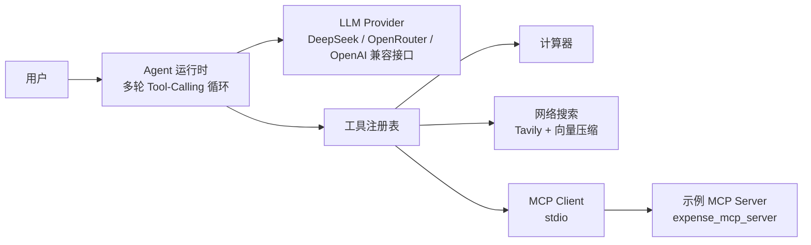

# AI Agent

一个基于 Rust 的 LLM Agent 框架：模型自主决策、多轮工具调用、结果反馈，直至收敛出最终答案。
不只是单次 Chat API 封装，而是完整的 Agent 运行时，支持统一工具抽象、MCP 协议集成、
流式输出、JSON Schema 强约束输出，以及网络搜索超长结果的向量压缩。

## 特性

- **多轮 Tool-Calling Agent 循环**：模型自主决定调用哪些工具，工具结果回传后继续推理，带最大步数控制。
- **统一工具抽象**：`Tool` trait + 动态注册表，工具参数通过 schemars 自动生成 JSON Schema 注入模型，新增工具无需模板代码。
- **MCP 集成**：通过 stdio 拉起子进程 MCP Server，动态读取工具清单并映射为 Agent 可调用工具（Client 与 Server 两侧均含示例代码）。
- **网络搜索压缩**：Tavily 搜索结果过长时，自动分块 → Embedding → 余弦相似度 Top-K 选择，显著降低回传模型的 token 量。
- **多形态 LLM 能力**：普通对话、流式输出、JSON Schema 强约束结构化输出、OpenAI 兼容多服务商（DeepSeek / OpenRouter / OpenAI）。
- **健壮性**：指数退避重试（对话、嵌入、搜索）、超时控制、工具失败信息回传模型自愈。

## 架构



## 目录结构

```text
src/
├── agent/
│   ├── runtime.rs            # Agent 主循环：多轮 tool-calling
│   ├── context.rs            # 执行上下文（事件流、步数、临时状态）
│   └── event.rs              # 事件模型（消息 / 工具调用 / 工具结果）
├── bin/
│   └── expense_mcp_server.rs # 示例 MCP Server（费用查询，stdio 传输）
├── llm/                      # LLM 能力封装
│   ├── chat.rs               # 普通对话
│   ├── chat_stream.rs        # 流式输出
│   ├── chat_schema.rs        # JSON Schema 强约束输出
│   └── chat_tool_calculator.rs # 工具调用循环
├── modals/                   # 参数 / 输出 Schema 定义
│   ├── tool.rs
│   ├── calculator.rs
│   ├── web_search.rs
│   └── math_solution.rs
├── state.rs                  # 模型常量
└── tools/
    ├── tool.rs               # Tool trait 与注册表
    ├── calculator.rs         # 计算器工具
    ├── web_search.rs         # Tavily 搜索 + 超长结果向量压缩
    ├── mcp/                  # MCP Client 集成
    └── vector/               # 分块 / 嵌入 / 相似度检索
examples/                     # 各能力演示
```

## 快速开始

### 环境要求

- Rust（2024 edition，建议 1.85+）
- 对话模型 API Key（DeepSeek / OpenRouter / OpenAI 任一）
- Tavily API Key（网络搜索）
- 嵌入服务 API Key（向量压缩，建议 OpenRouter）

### 配置环境变量

复制以下内容到项目根目录的 `.env`（`.env` 已被 `.gitignore` 忽略，不会提交）：

```dotenv
# 对话模型（OpenAI 兼容接口，按需修改服务商）
OPENAI_API_KEY=sk-xxx
OPENAI_BASE_URL=https://api.deepseek.com/v1

# 网络搜索（Tavily）
TVLY_API_KEY=tvly-xxx

# 向量嵌入（独立于对话模型配置）
EMBED_API_KEY=sk-or-v1-xxx
EMBED_BASE_URL=https://openrouter.ai/api/v1
```

### 运行

```bash
# 编译检查
cargo check

# 单元测试
cargo test

# Agent 多工具演示（计算 / 搜索 / MCP 费用查询）
cargo run --example chat_agent

# 网络搜索 + 向量压缩演示
cargo run --example chat_vector
```

## 示例一览

| 示例 | 演示内容 |
| --- | --- |
| `chat` | 普通对话 |
| `chat_stream` | 流式输出 |
| `chat_schema` | JSON Schema 强约束结构化输出 |
| `chat_json_output_ds` | DeepSeek JSON 输出 |
| `chat_tool_calculator` | 工具调用循环（并发示例） |
| `chat_tool_mcp` | 工具调用 + MCP 动态工具 |
| `chat_agent` | 完整 Agent：多步循环 + 多工具协同 |
| `chat_vector` | 网络搜索 + 向量压缩 |

## 核心概念

### Tool trait

所有工具实现统一的 `Tool` trait：名称、描述、参数 Schema、执行逻辑，以及可选的
`before_callback` / `after_callback` 钩子（用于调用前确认、调用后处理）。

```rust
#[async_trait::async_trait]
pub trait Tool: Send + Sync {
    fn name(&self) -> &str;
    fn description(&self) -> &str;
    fn parameters(&self) -> Value;              // 自动生成 JSON Schema
    async fn execute(&self, args: &str) -> Result<String>;
    async fn before_callback(&self, tool_view: &ToolView) -> Option<String> { None }
    async fn after_callback(&self, tool_view: &ToolView, result: String) -> String { result }
}
```

### Agent 循环

1. 将系统提示、历史事件、工具 Schema 组装为请求。
2. 模型返回工具调用 → 依次执行 → 结果作为 tool message 回传。
3. 循环直至模型直接输出答案，或达到最大步数（默认 10）。

### MCP 集成

`McpClient` 通过 rmcp 以 stdio 拉起子进程 MCP Server，`list_tools` 获取远程工具清单，
`McpTool` 将其包装为标准 `Tool` 接入注册表；`expense_mcp_server` 是配套的示例 Server。

### 向量压缩

当搜索结果超过阈值（默认 500 字符）时：分块（100 字符 / 50 重叠）→ 批量 Embedding →
与查询计算余弦相似度 → 堆选择 Top-3，只把最相关的片段回传模型。

## 已知限制

- `web_search` 的 `before_callback` 目前是交互式确认（控制台输入 y/n），非交互环境下会直接拒绝调用。
- 示例 MCP Server（`expense_mcp_server`）的 token 与 base_url 为演示写死，接入真实服务前需替换。
- 嵌入与对话共用 OpenAI 兼容协议，但服务商独立配置（`EMBED_*` / `OPENAI_*`），请勿混用密钥。
- 当前测试覆盖集中在文本分块逻辑，Agent 循环与工具层尚未覆盖集成测试。


## License

本项目为个人学习项目，未指定 License。
